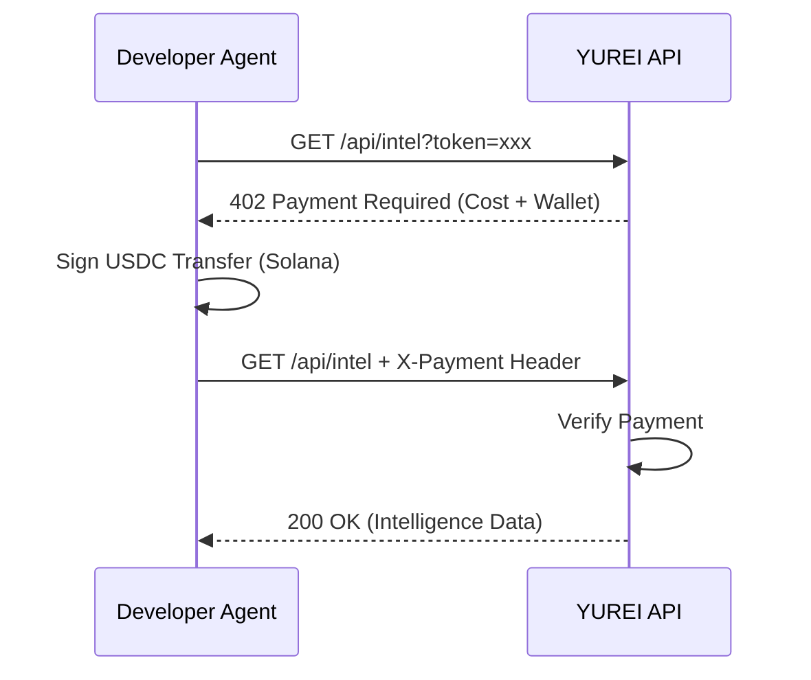

# YUREI x402 Agent Access

x402 micropayment integration for YUREI Agent API.

## What is this?

This demonstrates **x402 protocol** for agent-to-agent API access:

- Agent requests `/api/intel` → Server returns `402 Payment Required`
- Agent pays USDC on Solana → Retries with `X-Payment` header
- Server verifies payment → Returns intelligence data

## Quick Start

```bash
npm install
cp .env.example .env

# Terminal 1
npm run server

# Terminal 2
npm run client
```

## Architecture Flow



## API

### GET /api/intel?token=\<address\>

Returns token intelligence after x402 payment.

**402 Response:**
```json
{
  "accepts": [{
    "scheme": "exact",
    "network": "solana:EtWTRABZaYq6iMfeYKouRu166VU2xqa1",
    "maxAmountRequired": "100000",
    "payTo": "...",
    "asset": "USDC"
  }],
  "x402Version": 1
}
```

**200 Response:**
```json
{
  "token": "...",
  "analysis": {
    "riskScore": 45,
    "riskLevel": "MEDIUM",
    "sniperCount": 12
  }
}
```

## Stack

- TypeScript
- Express
- Solana / USDC
- x402 Protocol

## Links

- [x402 Protocol](https://x402.org)
- [YUREI AI](https://yureiai.xyz)
